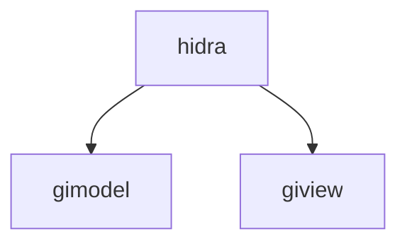

# Sistema HIDRA
El sistema desarrollado es operado por el personal del SENAPI especificamente para quienes trabajan con tramites referente a SIGNOS. 
## Descarga del proyecto
Si se quiere descargar el proyecto se debe ejecutar el siguiente comando en la terminal:
```bash
git clone https://gitlab.com/HIDRA/hidra.git
```
## Organización del sistema HIDRA
El proyecto consta de dos carpetas gimodel y giview.
* gimodel: Se encuentra el mapeado y la declaración de los servicios. 
* giview: Se encuentran los bean. 

## Modificaciones para Subir al servidor
Para subir al servidor es necesario seguir las siguientes instrucciones:
1. Modificar el archivo applicationContext.xm. Este proceso se debe realizar para las conexiones a las bases de datos del sistema HIDRA, SIPI y a la base de datos hidra_img.
```xml
<!--comentar codigo-->
   <bean id="dataSourceSO" class="org.springframework.jdbc.datasource.DriverManagerDataSource">
       <property name="driverClassName" value="org.postgresql.Driver"/>
       <property name="url" value="jdbc:postgresql://host/hidra"/>
       <property name="username" value="usuario"/>
       <property name="password" value="codigousuario"/>
   </bean>
<!--Descomentar Bloque de pool de conexion -->
    <bean id="dataSourceSO" class="org.springframework.jndi.JndiObjectFactoryBean">
        <property name="jndiName" value="valorPoolConexionCreado"/>
        <property name="resourceRef" value="true"/>
    </bean>
```
   
2. Luego de los respectivos cambios se debe hacer un Clean and Build(dependiendo del editor que se usa) primero el gimodel y luego de giview.  
3. Verficar que el archivo .war se haya generado correctamente, esto se ve en la carpeta /giview/target generada dentro del proyecto. 
4. Finalmente se debe deployar el .war dependiendo del servidor que se usa. 